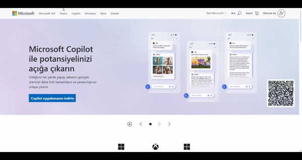

# Microsoft Web Sitesi Arayüzü Klonu

Bu proje, Microsoft web sitesinin arayüzünü klonlamak amacıyla oluşturulmuştur. Proje HTML, CSS ve JavaScript kullanılarak geliştirilmiştir.

## Özellikler

- **Responsive Tasarım:** Farklı ekran boyutlarına uyumlu tasarım.
- **Modern UI:** Microsoft web sitesine benzer şık ve modern kullanıcı arayüzü.
- **Kolay Kullanım:** Basit ve kullanıcı dostu navigasyon.

## Kurulum

Projeyi yerel makinenizde çalıştırmak için aşağıdaki adımları izleyin:

1. Bu depoyu klonlayın:
   ```bash
   git clone https://github.com/cengo14/microsoft-clone-project
   ```

2. Proje dizinine gidin:
   ```bash
   cd microsoft-clone-project
   ```

3. Projeyi bir tarayıcıda açın:
   - `index.html` dosyasını tarayıcınızda açarak projeyi görüntüleyebilirsiniz.

## Kullanılan Teknolojiler

- HTML5
- Bootstrap
- CSS3
- JavaScript

## Katkıda Bulunma

Katkıda bulunmak isterseniz, lütfen bir `pull request` gönderin. Her türlü katkı için teşekkür ederiz!

## Ekran Görüntüleri

Projenin bazı ekran görüntüleri:

### Anasayfa



---

Herhangi bir sorunuz veya öneriniz varsa, lütfen benimle iletişime geçmekten çekinmeyin. Keyifli kodlamalar!
